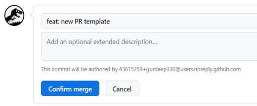

---
hide:
  - navigation
  - toc
---

</img>

# <font color=black>DevOps</font>
> <font color=black>ℹ️</font><br>
> **Date** 2024-11-02<br>
> **Version** 1.0<br>

1. [Introduction](#Introduction)
2. [Feedback and Issue Reporting](#feedback-and-issue-reporting)
3. [GitHub Repo Creation Workflow](#github-repo-creation-workflow)
4. [How to open and close a Pull request (PR)](#how-to-open-and-close-a-pull-request-pr)
5. [Environment](#environment)
6. [CI/CD pipeline](#cicd-pipeline)
7. [MkDocs for Documentation](#mkdocs-for-documentation)
8. [Automated workflows for testing, documentation, and release](#automated-workflows-for-testing-documentation-and-release)
 
## Introduction
Welcome to Team VPE's DevOps document! This document serves as a guide to our team's approach to managing the DevOps practices within our projects. Your insights and feedback are highly encouraged 😊<br>

🗸 **GitHub repo creation & workflow**: A table on repo operation on GitHub<br>
🗸 **Environment**: How to create a virtual environment for your projects.<br>
🗸 **CI/CD pipeline**: Workflow about our software development cycle.<br>
🗸 **MkDocs for Documentation**: How we leverage MkDocs for automating the documentation process.<br>
🗸 **Automated Workflows with GitHub Actions**: About the implementation of automated workflows using GitHub Actions, streamlining tasks such as testing, linting, code coverage, and version releases.<br>

## Feedback and Issue Reporting
For new features or bug reports in the repositories, please submit them via [GitHub Issues](https://github.com/VirtualPatientEngine/AIAgents4Pharma/issues). Thanks 😊.

## GitHub Repo Creation Workflow
In the table, you will find step-by-step instructions on how to fork a repo from the VPE team account to your private account, and then clone it onto your local machine for coding/development purposes.

| Step | How to do? |
| ---- | ---------- |
| 1. Fork the repo to your private account | On GitHub see [forking a repository](https://help.github.com/articles/fork-a-repo/) |
| 2. Clone the forked repo to your local machine | `git clone https://github.com/fork/repo`1️⃣ |
| 3. Configure Git to sync your fork (i.e. private account) with the original repo (i.e. VPE account) |> `git remote add upstream https://github.com/original.git`1️⃣<br>> `git remote -v` |
| 4. Create new feature/fix branch |> `git checkout -b feat/<feature-name>` OR<br> `git checkout -b fix/<fix-name>` |
| 5. Add changes to the new branch and commit the changes | > `git add .`<br>> `git commit -m ‘feat: add new changes’` |
| 6. Push the changes to your fork (i.e. private account) | > `git push origin feat/<feat-name>` OR<br>`git push origin fix/<fix-name>` |
| 7. Create a new pull-request (PR) on GitHub (private account) | See [creating a pull request](https://help.github.com/articles/creating-a-pull-request/). Follow the PR template.<br>Merge “feat/fix” on private account with “main” on VPE account |
| 8. Continue to make changes on your branch during code review (steps 6-8) | Min 1 approving review and pass all CI tests required to merge |
| 9a. Update your local feat/fix branch with recent changes from main branch on VPE account | > `git checkout feat/<feat-name>` OR `git checkout fix/<fix-name>`<br>> `git fetch upstream –prune`2️⃣<br>> `git merge upstream/feat/<feat-name>` OR `git merge upstream/fix/<fix-name>` |
| 9b. Update your local main branch with recent changes from main branch on VPE account (and then create a feat/fix branch out of it) | > `git checkout main`<br>> `git fetch upstream --prune`<br>> `git merge upstream/main` |
| 10. Delete the local feat/fix branch (optional) | > `git checkout main`<br>> `git branch -d feat` OR `git branch -d fix` |

1️⃣ Set this based on your cloning method (HTTPS or SSH)<br>
2️⃣ Typically used to update your local repository with changes from all remotes while also removing any local references to branches that have been deleted on the remote repository.


## How to open and close a Pull request (PR)
### Some general recommendations
1. Assign a single PR to each task. Avoid including unrelated changes in the same pull request to maintain focus and clarity.
2. Title and description serve as the initial means to explain the rationale behind each change.
3. Clearly state the purpose and objectives of the pull request to provide context for reviewers.
4. Break down changes into logically organized, bite-sized commits for easier review.
5. Ensure that each commit follows consistent coding conventions and standards (see the section on Coding practices in the CodeOps guide).
6. Include comprehensive test cases that cover both positive and negative scenarios (and edge/corner cases) and run them locally before creating the PR (see the section on Automated workflows for testing, documentation, and release in this guide).
7. Provide documentation updates alongside code changes to keep it synchronized (see the section on MkDocs for documentation in this guide)

### To open a PR, authors are required to:
1. Provide a title and description of the PR.
2. Make sure the change checks every item mentioned on the checklist in the PR template. If not, please specify the reasons in your PR.

### To close a PR, reviewers are required to:
1. Make sure the PR passes the automated tests (if applicable).
2. Make sure every item mentioned on your checklist in the template is addressed.
3. Please make sure to add a prefix (feat:/fix:/chore:) and/or a suffix BREAKING CHANGE (if it's a major release) to your commit message.

<br>
For instance, the commit message triggers a merge followed by the automated activation of the versioning tool (semantics-release). This tool increments the minor version (e.g., 2.1.1 changes to 2.2.0). 

<br>
Another instance, the commit message triggers a merge followed by the automated activation of the versioning tool (semantics-release). This tool increments the major version (e.g., 2.1.1 changes to 3.0.0).

4. If the PR closes an issue(s), please make sure to state it in your commit message. 

<br>
For instance, the commit message below triggers a merge followed by the automated activation of the versioning tool (semantics-release) and automatically closes issue #24.
 
5. Merging into main is supposed to run an automated release workflow, please make sure to check under the Actions tab to see if the workflow has been initiated and return later to verify that it has completed successfully.

## Environment
Here's a quick documentation on how to install a Python environment using venv:

1. Create a Virtual Environment:

        1. Open a terminal or command prompt.
        2. Navigate to your project directory.
        3. Run the following command to create a virtual environment: `python -m venv env`
        4. This command creates a folder named `env` which contains the isolated Python environment.

2. Activate the Virtual Environment:

        1. Activate the virtual environment by running the appropriate command based on your operating system: `.\env\Scripts\activate` (Windows) `source env/bin/activate` (MacOS and Linux)
        2. After activation, you'll notice `(env)` at the beginning of your command prompt, indicating that you are now working within the virtual environment.

3. Install dependencies: with the virtual environment activated, you can now install Python packages without affecting the global Python installation. Install the required packages using `pip`. For example: `pip install package1 package2`
4. Install dependencies from `requirements.txt`: `pip install -r requirements.txt`
5. Save dependencies to `requirements.txt` (useful when setting up a project for the first time after installing several libraries via pip): `pip freeze > requirements.txt`

*NOTE: By default, when you run git clone, it clones the entire repository, including all branches. However, it typically checks out the main branch after cloning*. If you want to install the package from a specific branch, either simply checkout to the branch: `git checkout develop`. Or use the -b flag followed by the branch name during git clone: `git clone -b develop https://github.com/VirtualPatientEngine/demo.git`.

6. Verify installation: `pip list`
7. Deactivate the Virtual Environment and return to the global Python environment, simply run: `deactivate`

That's it! You've successfully installed a Python environment using `venv` and recreated an existing environment from `requirements.txt`.

## CI/CD pipeline
A Continuous Integration/Continuous Deployment (CI/CD) pipeline is crucial for streamlining the software development lifecycle and delivering reliable and high-quality code.
 
<br>
The schema above provides an overview of the two phases of our CI/CD pipeline. It's essential to note that the CI/CD pipeline applies exclusively to code/shareable repositories.

### Development: 
The process begins with developers writing and committing code to GitHub

### GitHub Actions:
This phase involves:
1. Automating the setup of the environment, conducting tests, linting, and assessing code coverage. This is essential for maintaining code quality and ensuring that the code adheres to predefined standards.
2. Additionally, automatic document deployment (via MkDocs and GitHub pages) is initiated during this stage.
3. The final steps involve the release of the code through GitHub assets and wheel packages, facilitating seamless distribution of the shareable code.

## MkDocs for Documentation
### Why MkDocs?
1. MkDocs produces static pages from Markdown.
2. It pulls in code documentation from docstrings using a plug-in mkdocstrings.
3. Offers various themes to make your documentation look pretty.
4. Host your documentation on GitHub Pages
5. Automate code documentation using GitHub Actions

### How to implement MkDocs?
#### Docstrings
Make sure for every method and class you define, there is a docstring (would be awesome if you specify the examples, arguments and returns in the docstring – mkdocs can fetch that info too!)

```
def __init__(self, gnn_model,
               training_data,
               validation_data
               ) -> None:
       '''
       Initializes the link predictor model

       Args:
           gnn_model(GCNConv): The GNN model to be used for training (GraphAutoEncoder)
           training_data(torch_geometric.data.Data): The training data (PyG Data)
           validation_data(torch_geometric.data.Data): The validation data (PyG Data)

       Returns:
           None
       '''
```

<br>
The above docstring should produce the image in the documentation. 

#### In the docs/ folder:
1. Create an index.md file that contains information to be shown on the index page of the documentation.
2. Next, create a markdown file for every class or set of methods you want to document.
3. Within each markdown file, specify the name of the class or set of methods you want to be automatically read `:::folderName.module` e.g.: `:::tests.uniprot` where tests is a folder that contains the module _uniprot.py_. Note: You can also add additional text (in markdown format) in the file besides the syntax above
4. Open the file mkdocs.yml Add the paths to folders that contain the python code you want to document under the plugins (“app” & “tests” are added by default)
5. Under nav (navigation), set `<pageName>: <file.md>` where pageName is the name of the page you’d like to assign and _file.md_ is the file you created for the corresponding class/methods in the previous step. NOTE: You'll need to create the markdown files initially to set up a template. Afterwards, you'll only need to do this again if you've added a new script file or made significant modifications.

#### To view it locally
run `> mkdocs serve` in your terminal.

## Automated workflows for testing, documentation, and release
- In the repository, workflows are automated, configurable processes that execute one or more jobs.
- Each workflow is defined by a YAML file located in the repository and can be triggered by an event, manually, or on a defined schedule.
- We store our workflows in the `.github/workflows` directory, consistent with the workflows described in the *Testing Locally* section of the CodeOps guide.\
- These workflows are automatically triggered when a pull request (PR) is opened.
- To save resources and time, **we encourage you to run them locally before opening a PR.**