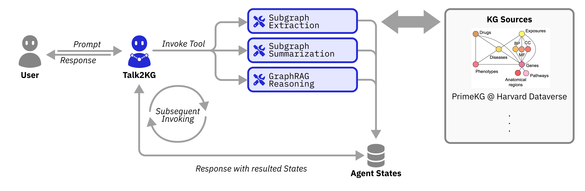

**Talk2KnowledgeGraphs** is an agent designed to enable interaction with biological knowledge graphs (KGs). KGs integrate vast amounts of structured biomedical data into a format that highlights relationships between entities, such as proteins, genes, diseases, drugs, etc.



## Tutorials
We have provided a series of tutorial in the forms of jupyter notebooks to help you get started with the library. The tutorials are available in the `docs/notebooks/talk2knowledgegraphs` directory.

For instance, we included a series of Jupyter notebooks to demonstrate the steps necessary to load PrimeKG and to construct IBD subgraph from PrimeKG.

### PrimeKG Loading
Precision Medicine Knowledge Graph (PrimeKG) is a comprehensive knowledge graph that presents a holistic view of diseases. PrimeKG integrates 20 high-quality biomedical resources to describe 17,080 diseases with 4,050,249 relationships representing ten major biological scales.

Source: [https://github.com/mims-harvard/PrimeKG](https://github.com/mims-harvard/PrimeKG)

The tutorial notebook to load the PrimeKG can be found in the following path:
```
docs\notebooks\talk2knowledgegraphs\tutorial_primekg_loader.ipynb
```

### IBD-sliced subgraph from PrimeKG
We have provided an example of working Jupyter notebook to construct a subgraph from PrimeKG in relation to a specific disease, i.e., inflammatory bowel disease (IBD).

The tutorial notebook to construct the subgraph can be found in the following path:
```
docs\notebooks\talk2knowledgegraphs\tutorial_primekg_subgraph.ipynb
```